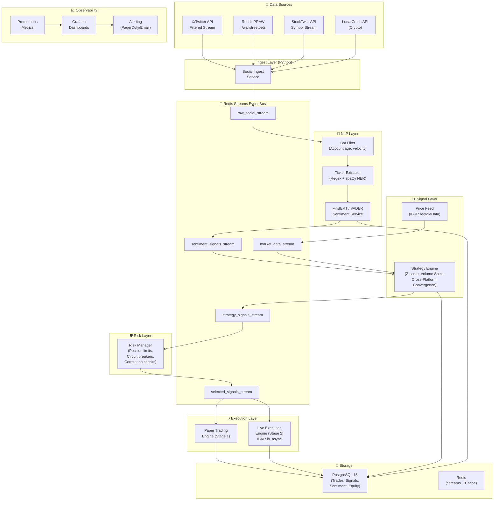

## 2. System Architecture

### High-Level Architecture

### Component Responsibilities

| Component | Responsibility | Technology |
|-----------|---------------|------------|
| Social Ingest Service | Stream from X API, Reddit, StockTwits; deduplicate; push to Redis | Python + asyncio, tweepy, praw |
| Bot Filter | Remove bots, spam, retweets before NLP processing | Python (account age, velocity checks) |
| Ticker Extractor | Extract $TICKER cashtags, company NER → validate against universe | spaCy NER + regex + S&P500 lookup |
| NLP Sentiment Service | Classify each post: POSITIVE/NEGATIVE/NEUTRAL + confidence score | HuggingFace FinBERT-Tone (yiyanghkust/finbert-tone) |
| Strategy Engine | Aggregate to per-ticker Z-scores; generate LONG/SHORT/FLAT signals | Python + Pandas |
| Price Feed | Real-time bid/ask + OHLCV from IBKR | ib_async reqMktData |
| Risk Manager | Position size, daily loss limit, correlation, circuit breakers | Python microservice |
| Paper Trading Engine | Simulated execution with slippage; P&L tracking | Python + PostgreSQL |
| Live Execution Engine | IBKR order placement via ib_async; bracket orders | ib_async (ib-api-reloaded/ib_async) |

---

---

*[⬆ Back to main index](README.md)*
