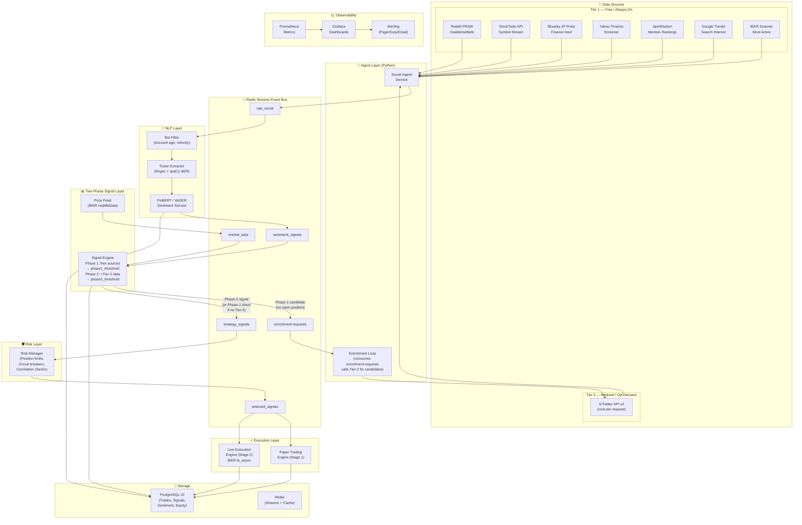

## 2. System Architecture

### High-Level Architecture

### Component Responsibilities

| Component | Responsibility | Technology |
|-----------|---------------|------------|
| Social Ingest Service | Poll/stream Tier-1 sources (Reddit, StockTwits, Bluesky, YFinance, ApeWisdom, Google Trends) for all watchlist tickers | Python + asyncio |
| Enrichment Loop | Consume `enrichment:requests`, call Tier-2 (X/Twitter) only for Phase-1 signal candidates | Python coroutine inside ingest service |
| Bot Filter | Remove bots, spam, retweets before NLP processing | Python (account age, velocity checks) |
| Ticker Extractor | Extract $TICKER cashtags, company NER → validate against universe | spaCy NER + regex + S&P500 lookup |
| NLP Sentiment Service | Classify each post: POSITIVE/NEGATIVE/NEUTRAL + confidence score | HuggingFace FinBERT-Tone (yiyanghkust/finbert-tone) |
| Signal Engine (Two-Phase) | Phase 1: evaluate free-source stats against `signal_phase1_threshold`; Phase 2: re-evaluate with Tier-2 data against `signal_phase2_threshold`. Suppresses tickers that fall below Phase-2 threshold (no Phase-1 fallback). | Python + asyncio |
| Price Feed | Real-time bid/ask + OHLCV from IBKR | ib_async reqMktData |
| Risk Manager | Pre-trade gate: position size, daily loss limit, circuit breakers. **Exit rule enforcement** (ATR stop, trailing stop, take-profit, time stop) lives in the Execution Service exit loop — not in the Risk Manager. | Python microservice |
| Paper Trading Engine | Simulated execution with slippage; P&L tracking | Python + PostgreSQL |
| Live Execution Engine | IBKR order placement via ib_async; OCA bracket orders (ATR stop + take-profit limit + trailing stop) | ib_async (ib-api-reloaded/ib_async) |

### Active Data Sources

The system currently uses the following ingestion sources. Tier classification determines whether the source triggers Tier-2 enrichment:

| Source | Tier | Type | Notes |
|--------|------|------|-------|
| Reddit (PRAW) | 1 | Social stream | r/wallstreetbets + others via config |
| StockTwits | 1 | Social API | Symbol stream; new account creation disabled by provider |
| Bluesky (AT Proto) | 1 | Social stream | Finance feed cashtag scanning |
| Yahoo Finance Screener | 1 | Market discovery | Trending/active screener for watchlist candidates |
| ApeWisdom | 1 | Social aggregator | Reddit mention rankings; no API key required |
| Google Trends | 1 | Search interest | Ticker search-volume spikes; discovery-only |
| IBKR Scanner | 1 | Market scanner | Most-active stocks directly from IB TWS |
| X/Twitter API v2 | 2 | Social API | Metered; only called for Phase-1 candidates |

> **Note:** ApeWisdom, Google Trends, and IBKR Scanner were added post-initial-design as StockTwits became unavailable for new registrations. They operate as Tier-1 discovery sources.

---

### Risk Pipeline Ownership

The risk pipeline is split across two services:

- **`risk_service`** — Pre-trade gate only. Evaluates new signals against position limits, portfolio exposure, VIX regime, and circuit breaker state before forwarding to `selected_signals`.
- **`execution_service` exit loop** — Owns all per-position exit rules: ATR stop-loss, take-profit, trailing stop tightening (mention-decay), sentiment reversal, maximum hold time. These rules are evaluated every cycle against live prices via `PositionExitManager`.

This split keeps the risk service stateless and fast for signal throughput, while the execution service handles the stateful position monitoring. The design docs in `06-risk-management.md` describe both layers together.

---

---

*[⬆ Back to main index](README.md)*
